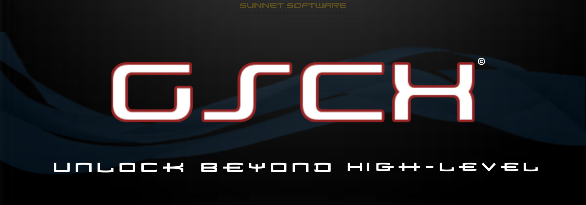

# GSCX — GameStation Computer X



**Version:** v0.1.0-alpha  
**Project lead:** HunterTheD3V  (Software Enginer, Lead Dev and CEO/Owner of SunFlare Technologies and Sunnet Software subsidiary). 
**License:** Apache 2.0 (see LICENSE and NOTICE)   
**Status:** Alpha — heavy engineering; not production-ready.

---

<p align="center">
  
</p>

---

## Overview

GSCX (GameStation Computer X) is a PS3 emulator built to provide a highly modular and realistic virtualization of PlayStation 3 hardware. GSCX blends low-level emulation with system spoofing to present a virtual PS3 environment on commodity PCs. The emulator supports reading real PS3 discs (official and unofficial), model-specific hardware profiles, and a custom HLE Recovery Mode implemented in C++ and Assembly.

**Key features:** 
- Virtualized PS3 environment with hardware profile selector (emulates storage, CPU behavior, RSX rendering, ). 
- Built-in Recovery Mode HLE (no NAND dumps required) for system operations. 
- Support for reading physical PS3 discs (requires a compatible disc drive, otherwise you can try using the Virtual Drive Allocator - VDA). 
- PS2 backward-compatible emulation modes for particular "fat" models via integration of PCSX2 EE/GS techniques from source and libs. 
- Spoofing layer that presents host CPU/GPU as CELL-BE/RSX to the virtualized machine. 
- Multi-language codebase: C++, C, Assembly (MASM), C, C#, Python, Lua (scripting), CMake (build - using MinGW, or you can use Linux Terminal). 
- Modular kernel (GSX) and emulator core (NOVA3) heritage and compatibility.

---

## Repository layout

```
/
├─ .venv/
├─ .tooling/ 
├─ build/
├─ docs/
├─ dotnet/
├─ pyapp/
├─ app.ini
├─ build_cpp.ps1
├─ build_dotnet.ps1
├─ main.py
├─ mingw_terminal.bat
├─ NOTICE
├─ LICENSE
├─ README.md
├─ run_gui.ps1
├─ docs.md
└─ ps3_models.json 
```

---

## Quickstart (Development)

> Environment assumed: Windows (MSYS - MinGW) or Linux. For Windows, WSL recommended for tooling parity. 

1. Clone repo:
```bash
git clone https://github.com/HunterTheD3V/Project-GSCX-Emulator.git 
cd project-gscx-emulator 
```

2. Initialize submodules (if any):
```bash
git submodule update --init --recursive
```

3. Create build dir and configure:
```bash
mkdir build && cd build
cmake .. -DCMAKE_BUILD_TYPE=Release
cmake --build . --config Release
```

4. Run basic tests:
```bash
ctest --output-on-failure
```
Bonus: check PUP file's integrity/working:
```bash
python tests/pupreader.py
```


5. Run emulator (example):
```bash
./gscx --profile CECHA01 --disc /dev/sr0
```

---

## Supported Platforms

- Windows 10/11 (MinGW, native Win32 build) 
- Linux (x86_64)
- Cross-compile targets supported by CMake toolchains

> NOTE: Blu-ray vs "Disc Readers" — GSCX reads raw PS3 media where supported by host drive and OS drivers. Verify your hardware compatibility (some USB external units may not expose the required raw sectors). 

---

## Hardware Profiles

Hardware profiles are defined in `./ps3_models.json`. Profiles specify: 
- model id (e.g., `CECHA01`)
- year
- default storage size (virtualized)
- retrocompatibility flags (PS2 EE/GS availability)
- other quirks (bluetooth stack, DVD/CD compatibility, bluetooth controller behavior) 

Profiles are hot-loadable and extendable. See `docs/profiles.md` for schema.

---

## Development notes

- **Spoofing layer**: implemented as an isolation boundary — keep host identification & API mapping confined to `core/spoof/`.
- **Recovery HLE**: code lives in `src/recovery/`, with assembly stubs in `core/asm/`.
- **PCSX2 integration**: limited to selected EE/GS techniques — all reused code respects original licenses. See `contrib/` for attributions.
- **Scripting**: Lua exposed for runtime automation and testing of console flows (e.g., automated update/patch flows in virtual environment).

---

## Testing & CI

- Unit tests: Catch2 (C++).
- Integration tests: VM harness that mounts test ISOs and exercises I/O paths.
- Fuzzing: libFuzzer harness for disc parser and network/name resolution logic.

Suggested GitHub Actions workflows:
- `build.yml` — compile artifacts for Windows & Linux.
- `test.yml` — run unit & integration tests; upload coverage.
- `release.yml` — tag & publish artifacts (zip, installer), sign with GPG.

---

## Security & Privacy

- GSCX can read physical media. Do **not** use copyrighted content without rightsholder permission. The project provides no legal cover for distribution of copyrighted games or ISOs.
- Telemetry is disabled by default. If telemetry is added, it must be opt-in and documented.

---

## Contribution

We welcome contributors. Please read `NOTICE` and `docs/CONTRIBUTION.md for: 
- Code style & linting
- PR checklist (unit tests, changelog entry, signed-off commits)
- Issue templates & security disclosures

---

## LICENSE & Legal Disclaimer

- **License:** Apache 2.0 Jan-2004. Check NOTICE file in the root. 
- **Legal:** GSCX does not stand for any side related to piracy. Whatever you do is your responsability and choice. GSCX IS NOT MADE TO FACILITATE PIRACY AND/OR OTHER ILEGAL PRACTICES. GSCX IS NOT A PLATFORM TO USE HACKS AND/OR PIRATED CONTENT, NOR PRODUCE PIRATED CONTENT. 

---

## Credits

- Core engine concepts: NOVA3 (SunFlare Network)
- Kernel: GSX (Sunnet Software)

- PCSX2 techniques: integration for PS2 backward compatibility (respective licenses apply).

---

## Roadmap (short)

1. Stabilize Recovery HLE and document its ABI (v0.2).
2. Expand hardware profile coverage and community contributed profiles.
3. CI cross-build + automated smoke tests for disc reading.
4. Public
