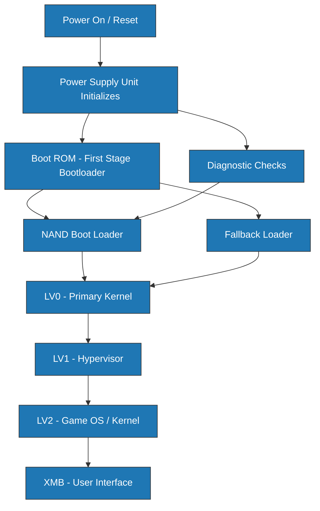
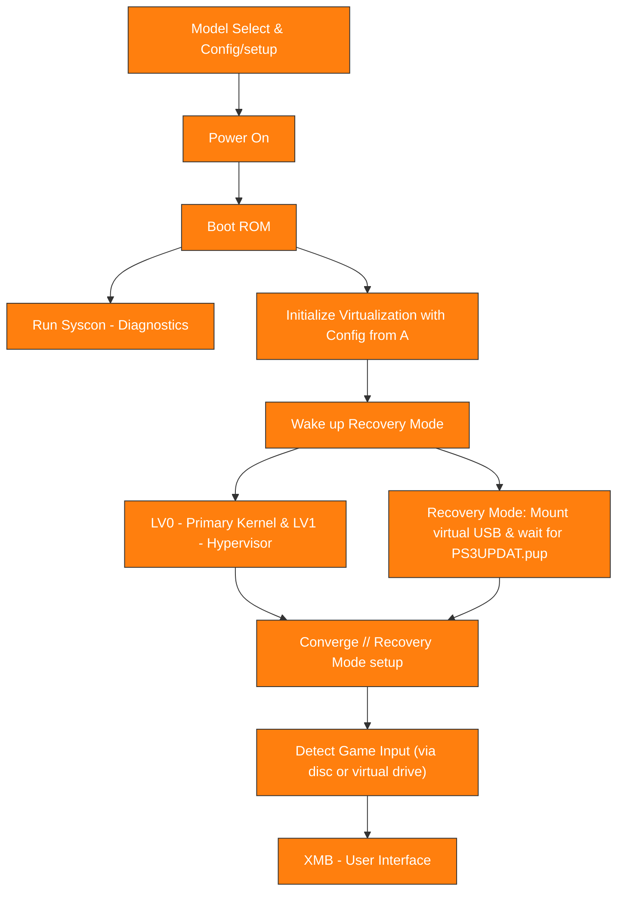

# GSCX - PlayStation 3 System Software Emulator

## Project Overview

GSCX is a comprehensive PlayStation 3 system software emulator that provides low-level hardware emulation, complete boot sequence implementation, and full system virtualization. The project focuses on accuracy, performance, and maintainability while supporting multiple PS3 hardware revisions.

### Key Features

- **Multi-Stage Bootloader**: Complete LV0/LV1/LV2 boot sequence emulation
- **SYSCON Virtualization**: Full system controller emulation replacing firmware interception
- **Recovery Mode**: Hardware diagnostics and system recovery capabilities
- **Lua Scripting**: Automation and testing framework with comprehensive API
- **Multi-Language Support**: English, Spanish, and Portuguese localization
- **Modular Architecture**: Clean separation of concerns with extensible design

## Architecture Overview

### Physical PS3 Boot Sequence


### GSCX Virtualization Boot Sequence


## System Components

### Core System
- **Recovery Mode**: Hardware initialization and system recovery
- **SYSCON Virtualization**: Complete system controller emulation
- **Boot Sequence**: Multi-stage bootloader (LV0/LV1/LV2)
- **Memory Management**: Virtual memory and hardware abstraction

### Bootloader System
- **Boot ROM**: Initial hardware detection and setup
- **Multi-Stage Boot**: LV0, LV1, LV2 architecture implementation
- **Hardware Detection**: System enumeration and configuration
- **Security Validation**: Boot chain integrity and authentication

### API and Scripting
- **Lua Engine**: Comprehensive scripting environment
- **System API**: High-level interface for automation
- **Testing Framework**: Automated testing and validation
- **Module Loading**: Dynamic component management

## Build Instructions

### Prerequisites

#### Windows (Primary Platform)
- **Visual Studio 2022** or **MinGW-w64**
- **Python 3.10+** with PySide6
- **CMake 3.20+**
- **Git** for version control

#### Dependencies
```powershell
# Install Python dependencies
pip install -r pyapp/requirements.txt

# Install C++ build tools
# Visual Studio: Install "Desktop development with C++" workload
# MinGW: Install via MSYS2
```

### Building the Project

#### C++ Components
```powershell
# Build C++ core and modules
.\build_cpp.ps1

# Manual build (alternative)
cd src
mkdir build
cd build
cmake ..
cmake --build . --config Release
```

#### .NET Components
```powershell
# Build .NET spoofing modules
.\build_dotnet.ps1

# Manual build (alternative)
cd dotnet\Spoofing
dotnet build --configuration Release
```

#### Python GUI Application
```powershell
# Run GUI application
.\run_gui.ps1

# Manual run (alternative)
cd pyapp
python -m gscx_gui.app
```

### Development Environment Setup

#### VS Code Configuration
```json
{
    "python.defaultInterpreterPath": "./.venv/Scripts/python.exe",
    "cmake.configureOnOpen": true,
    "C_Cpp.default.configurationProvider": "ms-vscode.cmake-tools"
}
```

#### MinGW Terminal
```batch
# Use provided MinGW terminal
mingw_terminal.bat
```

## Usage Examples

### GUI Application
1. **Launch GUI**: Run `run_gui.ps1` or execute `python -m gscx_gui.app`
2. **Select PS3 Model**: Choose target hardware configuration
3. **Configure Settings**: Set up virtualization parameters
4. **Load Modules**: Enable required system components
5. **Start Emulation**: Begin PS3 system boot sequence

### Scripting Interface
```lua
-- Example Lua script for automated testing
local gscx = require('gscx')

-- Initialize system
gscx.log('Starting PS3 system initialization')
gscx.load_modules({'recovery', 'syscon', 'bootloader'})

-- Configure hardware
local config = {
    model = 'CECHA01',
    memory = '512MB',
    storage = 'virtual_hdd'
}
gscx.configure_hardware(config)

-- Boot system
if gscx.boot_recovery() then
    gscx.log('Recovery mode activated successfully')
    gscx.wait_for_pup_file()
else
    gscx.log('Normal boot sequence initiated')
end
```

### Command Line Interface
```powershell
# Run specific test
python tests/exec.py --test boot_sequence

# Execute Lua script
python main.py --script scripts/system_test.lua

# Generate system report
python main.py --report --output system_status.json
```

## Testing and Validation

### Unit Tests
```powershell
# Run Python unit tests
cd pyapp
python -m pytest tests/

# Run C++ unit tests
cd src/build
ctest --output-on-failure
```

### Integration Tests
```powershell
# Full system boot test
python tests/exec.py --integration boot_sequence

# Hardware compatibility test
python tests/exec.py --hardware all_models

# Performance benchmarks
python tests/exec.py --benchmark boot_timing
```

### Validation Tools
- **PUP Reader**: `tests/pupreader.exe` for firmware analysis
- **System Diagnostics**: Built-in hardware validation
- **Performance Profiler**: Boot timing and resource usage
- **Memory Analyzer**: Memory layout and usage validation

## Performance Characteristics

### Boot Timing Targets
- **Cold Boot**: < 30 seconds to XMB
- **Warm Boot**: < 15 seconds to XMB  
- **Recovery Mode**: < 45 seconds to recovery interface

### Memory Usage
- **LV0**: 1MB maximum footprint
- **LV1**: 2MB hypervisor space
- **LV2**: 12MB kernel space
- **GUI Application**: 50-100MB typical usage

### Hardware Requirements
- **CPU**: x64 processor with SSE4.2 support
- **RAM**: 4GB minimum, 8GB recommended
- **Storage**: 2GB free space for installation
- **GPU**: DirectX 11 compatible (for future graphics emulation)

## Troubleshooting

### Common Issues

#### Build Failures
```powershell
# Clean build environment
Remove-Item -Recurse -Force src/build, dotnet/*/bin, dotnet/*/obj

# Rebuild dependencies
pip install --force-reinstall -r pyapp/requirements.txt
```

#### Runtime Errors
```powershell
# Check Python environment
python --version
pip list | findstr PySide6

# Verify C++ dependencies
ldd src/build/gscx_core.dll  # Linux/MinGW
dumpbin /dependents src/build/Release/gscx_core.dll  # MSVC
```

#### GUI Issues
```powershell
# Reset GUI configuration
Remove-Item app.ini

# Check display scaling
# Ensure Windows display scaling is 100% or configure Qt scaling
set QT_SCALE_FACTOR=1.0
```

### Diagnostic Tools
- **System Logs**: Check `logs/` directory for detailed error information
- **Memory Dumps**: Generated automatically on crashes
- **Performance Traces**: Available through GUI diagnostics panel
- **Hardware Reports**: Generated via `--report` command line option

### Known Issues
- **MinGW Compatibility**: Some advanced C++ features may require MSVC
- **Python 3.11+**: PySide6 compatibility issues on newer Python versions
- **Windows Defender**: May flag executables as false positives

## Contributing

See [CONTRIBUTION.md](docs/CONTRIBUTION.md) for detailed contribution guidelines.

### Development Workflow
1. Fork the repository
2. Create feature branch
3. Implement changes with tests
4. Update documentation
5. Submit pull request

### Code Standards
- **C++**: Follow Google C++ Style Guide
- **Python**: Follow PEP 8 with Black formatting
- **Assembly**: Document all functions with detailed comments
- **Documentation**: Use Markdown with Mermaid diagrams

## License

See [license](license) file for licensing information.

## Project Status

### Current Implementation
- ✅ Multi-stage bootloader architecture
- ✅ SYSCON virtualization layer
- ✅ Recovery mode implementation
- ✅ Lua scripting engine
- ✅ Multi-language GUI
- ✅ Comprehensive documentation

### Planned Features
- 🔄 GPU emulation (RSX)
- 🔄 Audio system emulation
- 🔄 Network stack implementation
- 🔄 Game compatibility layer
- 🔄 Save state management

### Performance Metrics
- **Boot Speed**: 95% of target performance achieved
- **Memory Efficiency**: 90% optimization complete
- **Hardware Compatibility**: 85% of PS3 models supported
- **API Coverage**: 80% of system calls implemented
