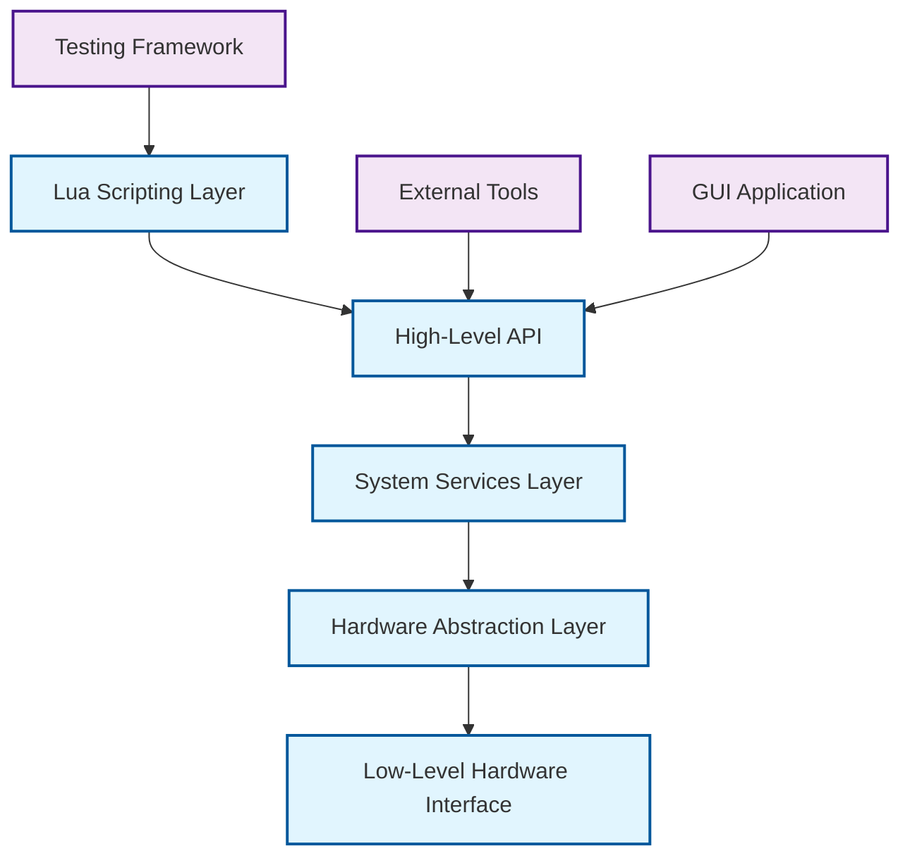

# GSCX API Documentation

## Overview

The GSCX API provides comprehensive interfaces for PlayStation 3 system emulation, including low-level hardware access, system services, and high-level automation through Lua scripting. The API is designed for both internal system operations and external tool development.

## Table of Contents

- [Lua Scripting API](lua-api.md) - Complete Lua interface reference
- [System Services](system-services.md) - Core system service interfaces
- [Hardware Abstraction](hardware-api.md) - Low-level hardware access
- [Memory Management](memory-api.md) - Memory allocation and management
- [Boot Services](boot-api.md) - Bootloader and initialization APIs
- [SYSCON Interface](syscon-api.md) - System controller virtualization
- [Recovery Mode API](recovery-api.md) - Recovery and diagnostic interfaces
- [Testing Framework](testing-api.md) - Automated testing and validation

## API Architecture

### Layered Design



### Core Components

#### 1. Lua Scripting Engine
- **Purpose**: High-level automation and testing
- **Features**: Complete PS3 system access, event handling, async operations
- **Use Cases**: Automated testing, system diagnostics, custom workflows

#### 2. System Services
- **Purpose**: Core system functionality abstraction
- **Features**: Process management, IPC, resource allocation
- **Use Cases**: Application development, system integration

#### 3. Hardware Abstraction Layer (HAL)
- **Purpose**: Platform-independent hardware access
- **Features**: CPU, memory, I/O, and peripheral interfaces
- **Use Cases**: Cross-platform compatibility, hardware virtualization

#### 4. Low-Level Interface
- **Purpose**: Direct hardware manipulation
- **Features**: Register access, memory mapping, interrupt handling
- **Use Cases**: Performance optimization, hardware debugging

## API Categories

### System Management

| Function Category | Description | Access Level |
|------------------|-------------|-------------|
| **Boot Control** | System initialization and boot sequence | System |
| **Process Management** | Process creation, scheduling, termination | System |
| **Memory Management** | Virtual memory, heap allocation, garbage collection | System/User |
| **Resource Management** | File handles, network connections, hardware locks | User |

### Hardware Interface

| Component | API Coverage | Implementation Status |
|-----------|-------------|----------------------|
| **CPU (Cell BE)** | Complete | ✅ Implemented |
| **Memory (XDR/GDDR3)** | Complete | ✅ Implemented |
| **RSX Graphics** | Partial | 🔄 In Progress |
| **I/O Controllers** | Complete | ✅ Implemented |
| **Network Interface** | Basic | 🔄 In Progress |
| **Audio (SPU)** | Partial | 🔄 In Progress |

### Emulation Services

| Service | Description | Lua Access | C++ Access |
|---------|-------------|------------|------------|
| **SYSCON** | System controller emulation | ✅ | ✅ |
| **Recovery Mode** | Hardware diagnostics and recovery | ✅ | ✅ |
| **Bootloader** | Multi-stage boot sequence | ✅ | ✅ |
| **Hypervisor** | LV1 virtualization layer | ⚠️ Limited | ✅ |
| **Game OS** | LV2 kernel services | ✅ | ✅ |

## Quick Start Examples

### Lua Scripting

```lua
-- Initialize GSCX system
local gscx = require('gscx')

-- Configure logging
gscx.log.set_level('INFO')
gscx.log.to_file('system.log')

-- Load system modules
local modules = {'syscon', 'recovery', 'bootloader'}
for _, module in ipairs(modules) do
    if not gscx.load_module(module) then
        gscx.log.error('Failed to load module: ' .. module)
        return false
    end
end

-- Configure hardware
local config = {
    model = 'CECHA01',
    memory_xdr = 256,
    memory_gddr3 = 256,
    cpu_threads = 6
}

if gscx.configure_hardware(config) then
    gscx.log.info('Hardware configured successfully')
else
    gscx.log.error('Hardware configuration failed')
    return false
end

-- Start system boot
if gscx.boot.start() then
    gscx.log.info('System boot initiated')
    
    -- Wait for boot completion
    while gscx.boot.get_status() == 'booting' do
        gscx.sleep(100)  -- 100ms
    end
    
    if gscx.boot.get_status() == 'ready' then
        gscx.log.info('System ready')
    else
        gscx.log.error('Boot failed: ' .. gscx.boot.get_error())
    end
end
```

### C++ Integration

```cpp
#include "gscx/api.h"
#include "gscx/system.h"
#include "gscx/hardware.h"

int main() {
    // Initialize GSCX API
    if (!gscx::api::initialize()) {
        std::cerr << "Failed to initialize GSCX API" << std::endl;
        return 1;
    }
    
    // Create system instance
    auto system = gscx::system::create(gscx::model::CECHA01);
    if (!system) {
        std::cerr << "Failed to create system instance" << std::endl;
        return 1;
    }
    
    // Configure memory
    gscx::memory::config mem_config;
    mem_config.xdr_size = 256 * 1024 * 1024;  // 256MB
    mem_config.gddr3_size = 256 * 1024 * 1024;  // 256MB
    
    if (!system->configure_memory(mem_config)) {
        std::cerr << "Memory configuration failed" << std::endl;
        return 1;
    }
    
    // Start boot sequence
    system->boot_async([](gscx::boot::status status) {
        switch (status) {
            case gscx::boot::status::ready:
                std::cout << "System ready" << std::endl;
                break;
            case gscx::boot::status::error:
                std::cerr << "Boot error" << std::endl;
                break;
            default:
                std::cout << "Boot status: " << static_cast<int>(status) << std::endl;
        }
    });
    
    // Main loop
    while (system->is_running()) {
        system->update();
        std::this_thread::sleep_for(std::chrono::milliseconds(16));
    }
    
    // Cleanup
    gscx::api::shutdown();
    return 0;
}
```

### Python Integration

```python
import gscx
from gscx import system, hardware, boot

def main():
    # Initialize GSCX
    if not gscx.initialize():
        print("Failed to initialize GSCX")
        return False
    
    try:
        # Create system configuration
        config = gscx.SystemConfig(
            model='CECHA01',
            memory_xdr=256,
            memory_gddr3=256,
            cpu_threads=6
        )
        
        # Create and configure system
        ps3_system = system.create(config)
        if not ps3_system:
            print("Failed to create PS3 system")
            return False
        
        # Set up event handlers
        def on_boot_progress(stage, progress):
            print(f"Boot stage {stage}: {progress}%")
        
        def on_boot_complete(success, error=None):
            if success:
                print("System boot completed successfully")
            else:
                print(f"Boot failed: {error}")
        
        ps3_system.on_boot_progress = on_boot_progress
        ps3_system.on_boot_complete = on_boot_complete
        
        # Start boot process
        if ps3_system.boot():
            print("Boot process started")
            
            # Wait for completion
            ps3_system.wait_for_boot(timeout=60)  # 60 seconds timeout
            
            if ps3_system.is_ready():
                print("System is ready for operation")
                return True
            else:
                print("System failed to reach ready state")
                return False
        else:
            print("Failed to start boot process")
            return False
            
    finally:
        gscx.shutdown()

if __name__ == "__main__":
    main()
```

## Error Handling

### Error Codes

| Code | Name | Description |
|------|------|-------------|
| `0x0000` | `SUCCESS` | Operation completed successfully |
| `0x1001` | `INIT_FAILED` | System initialization failed |
| `0x1002` | `CONFIG_INVALID` | Invalid configuration parameters |
| `0x1003` | `HARDWARE_ERROR` | Hardware access error |
| `0x1004` | `MEMORY_ERROR` | Memory allocation/access error |
| `0x1005` | `BOOT_FAILED` | Boot sequence failure |
| `0x1006` | `MODULE_NOT_FOUND` | Required module not available |
| `0x1007` | `PERMISSION_DENIED` | Insufficient permissions |
| `0x1008` | `TIMEOUT` | Operation timed out |
| `0x1009` | `RESOURCE_BUSY` | Resource currently in use |
| `0x100A` | `NOT_IMPLEMENTED` | Feature not yet implemented |

### Exception Handling

```lua
-- Lua error handling
local success, result = pcall(function()
    return gscx.risky_operation()
end)

if not success then
    gscx.log.error('Operation failed: ' .. tostring(result))
    -- Handle error appropriately
end
```

```cpp
// C++ exception handling
try {
    system->risky_operation();
} catch (const gscx::hardware_error& e) {
    std::cerr << "Hardware error: " << e.what() << std::endl;
} catch (const gscx::api_error& e) {
    std::cerr << "API error: " << e.what() << " (code: " << e.code() << ")" << std::endl;
} catch (const std::exception& e) {
    std::cerr << "Unexpected error: " << e.what() << std::endl;
}
```

## Performance Considerations

### Best Practices

1. **Resource Management**
   - Always release acquired resources
   - Use RAII patterns in C++
   - Implement proper cleanup in Lua scripts

2. **Memory Usage**
   - Minimize memory allocations in hot paths
   - Use object pooling for frequently created objects
   - Monitor memory usage with built-in profiling tools

3. **Threading**
   - Use async APIs for long-running operations
   - Avoid blocking the main thread
   - Implement proper synchronization

4. **Hardware Access**
   - Batch hardware operations when possible
   - Use DMA for large memory transfers
   - Cache frequently accessed hardware state

### Performance Monitoring

```lua
-- Enable performance profiling
gscx.profiler.enable()
gscx.profiler.set_output('performance.log')

-- Your code here
gscx.profiler.begin_section('critical_operation')
-- ... critical code ...
gscx.profiler.end_section('critical_operation')

-- Generate performance report
gscx.profiler.generate_report()
```

## Security Model

### Access Control

- **System Level**: Full hardware access, kernel operations
- **User Level**: Restricted hardware access, sandboxed operations
- **Script Level**: Controlled API access, resource limits

### Sandboxing

```lua
-- Create sandboxed environment
local sandbox = gscx.create_sandbox({
    memory_limit = 64 * 1024 * 1024,  -- 64MB
    cpu_time_limit = 5000,  -- 5 seconds
    allowed_modules = {'log', 'math', 'string'}
})

-- Execute code in sandbox
local result = sandbox:execute([[
    -- Sandboxed Lua code here
    return "Hello from sandbox"
]])
```

## Debugging and Diagnostics

### Debug Interface

```cpp
// Enable debug mode
gscx::debug::enable();
gscx::debug::set_level(gscx::debug::level::verbose);

// Set breakpoints
gscx::debug::set_breakpoint(0x80010000);  // LV2 kernel entry

// Register debug callback
gscx::debug::set_callback([](const gscx::debug::event& event) {
    std::cout << "Debug event: " << event.description << std::endl;
});
```

### System Diagnostics

```lua
-- Run system diagnostics
local diag = gscx.diagnostics.run_full_test()

for component, result in pairs(diag.results) do
    if result.status == 'pass' then
        gscx.log.info(component .. ': PASS')
    else
        gscx.log.error(component .. ': FAIL - ' .. result.error)
    end
end
```

## Version Compatibility

### API Versioning

- **Major Version**: Breaking changes, incompatible API modifications
- **Minor Version**: New features, backward-compatible additions
- **Patch Version**: Bug fixes, performance improvements

### Compatibility Matrix

| GSCX Version | API Version | Lua Version | Python Version | .NET Version |
|--------------|-------------|-------------|----------------|--------------|
| 1.0.x | 1.0 | 5.4+ | 3.10+ | 6.0+ |
| 1.1.x | 1.1 | 5.4+ | 3.10+ | 6.0+ |
| 2.0.x | 2.0 | 5.4+ | 3.11+ | 7.0+ |

## Migration Guide

For upgrading between API versions, see the [migration guide](migration.md).

## Contributing

To contribute to the API development:

1. Follow the [API design guidelines](api-guidelines.md)
2. Implement comprehensive unit tests
3. Update documentation for all changes
4. Ensure backward compatibility when possible
5. Submit pull requests with detailed descriptions

For more information, see the [contribution guidelines](../CONTRIBUTION.md).