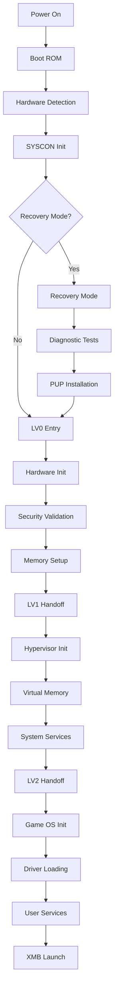

# Bootloader System

The GSCX PS3 emulator bootloader system provides comprehensive boot sequence management, hardware initialization, and system recovery capabilities.

## Table of Contents

- [Boot ROM](boot-rom.md) - Initial boot ROM implementation and hardware detection
- [Multi-Stage Boot](multi-stage-boot.md) - LV0, LV1, LV2 bootloader architecture
- [Hardware Detection](hardware-detection.md) - System hardware enumeration and configuration
- [Security Validation](security-validation.md) - Boot chain integrity and authentication
- [Recovery Procedures](recovery-procedures.md) - System recovery and diagnostic modes
- [Memory Initialization](memory-initialization.md) - Memory controller setup and testing

## Overview

The bootloader system implements a faithful emulation of the PS3 boot sequence, providing:

### Multi-Stage Architecture
- **Boot ROM**: Initial hardware detection and basic system setup
- **LV0 (Level 0)**: Primary kernel with hardware initialization and security validation
- **LV1 (Level 1)**: Hypervisor layer with virtual memory management and system services
- **LV2 (Level 2)**: Game OS kernel with device drivers and user services

### Key Features
- Hardware-accurate boot timing and sequences
- Comprehensive security validation and integrity checking
- Modular recovery and diagnostic capabilities
- Real-time hardware state monitoring
- Extensible hook system for custom boot procedures

### Security Implementation
- Boot chain signature verification
- Hardware authenticity validation
- Secure boot environment setup
- Anti-tampering detection mechanisms

## Boot Flow Overview

## Hardware Compatibility

The bootloader supports emulation of multiple PS3 hardware revisions:

### Supported Models
- **PS3 Fat (CECHA/CECHB)**: Full backward compatibility with PS2/PS1
- **PS3 Fat (CECHC/CECHE)**: Partial PS2 compatibility
- **PS3 Slim (CECH-2xxx)**: PS3-only compatibility
- **PS3 Super Slim (CECH-4xxx)**: Latest hardware revision

### Hardware Detection
- Automatic model identification
- Memory configuration detection
- Storage device enumeration
- Network interface detection
- USB controller initialization

## Performance Characteristics

### Boot Timing Targets
- **Cold Boot**: < 30 seconds to XMB
- **Warm Boot**: < 15 seconds to XMB
- **Recovery Mode**: < 45 seconds to recovery interface

### Memory Usage
- **LV0**: 1MB maximum footprint
- **LV1**: 2MB hypervisor space
- **LV2**: 12MB kernel space
- **Total System**: 256MB-512MB depending on model

## Development Guidelines

### Code Organization
- Assembly code for critical boot paths
- C++ for complex initialization logic
- Modular design with clear interfaces
- Comprehensive error handling and logging

### Testing Requirements
- Unit tests for individual boot stages
- Integration tests for complete boot sequences
- Hardware compatibility validation
- Performance benchmarking
- Security validation testing

### Documentation Standards
- Document all assembly functions with detailed comments
- Provide usage examples for all public interfaces
- Include performance characteristics and limitations
- Maintain compatibility matrices for hardware support

## Integration Points

The bootloader integrates with:
- **Core System**: Hardware abstraction and virtualization
- **Recovery Mode**: Diagnostic and repair capabilities
- **SYSCON**: System controller communication
- **Security**: Boot chain validation and authentication
- **API**: High-level system interface

## Troubleshooting

### Common Boot Issues
- Hardware detection failures
- Memory initialization problems
- Security validation errors
- Driver loading failures
- Recovery mode activation

### Diagnostic Tools
- Boot sequence logging
- Hardware state inspection
- Memory dump capabilities
- Performance profiling
- Error code interpretation