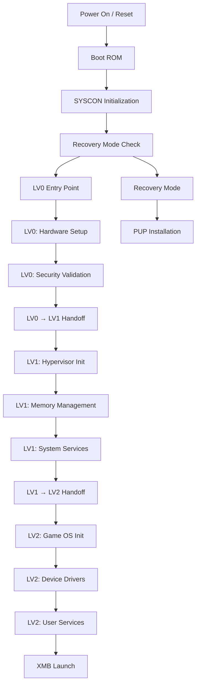

# Boot Sequence - Multi-Stage Bootloader

The GSCX PS3 emulator implements a multi-stage bootloader architecture that closely mirrors the original PS3 boot sequence through LV0, LV1, and LV2 stages.

## Overview

The boot sequence consists of three primary levels:
- **LV0**: Initial hardware setup and security validation
- **LV1**: Hypervisor initialization and system preparation  
- **LV2**: Final system boot and service initialization

## Architecture Diagram



## LV0 - Primary Kernel

### Hardware Initialization

```assembly
; LV0 Entry Point - First stage bootloader
; Called after SYSCON initialization and recovery check
.section .text.lv0
.global lv0_entry_point

lv0_entry_point:
    ; Disable interrupts during critical initialization
    cli
    
    ; Setup initial stack for LV0
    mov     rsp, LV0_STACK_TOP
    
    ; Clear CPU state
    call    lv0_clear_cpu_state
    
    ; Initialize memory controller
    call    lv0_init_memory_controller
    
    ; Setup basic memory mapping
    call    lv0_setup_memory_map
    
    ; Initialize security subsystem
    call    lv0_init_security
    
    ; Validate system integrity
    call    lv0_validate_system
    
    ; Prepare for LV1 handoff
    call    lv0_prepare_lv1_environment
    
    ; Jump to LV1
    jmp     lv1_entry_point

; Clear CPU registers and flags to known state
lv0_clear_cpu_state:
    ; Clear general purpose registers
    xor     rax, rax
    xor     rbx, rbx
    xor     rcx, rcx
    xor     rdx, rdx
    xor     rsi, rsi
    xor     rdi, rdi
    xor     r8, r8
    xor     r9, r9
    xor     r10, r10
    xor     r11, r11
    xor     r12, r12
    xor     r13, r13
    xor     r14, r14
    xor     r15, r15
    
    ; Clear flags register
    push    0
    popf
    
    ret
```

### Memory Controller Setup

```cpp
class LV0MemoryController {
public:
    struct MemoryRegion {
        uint64_t physical_base;
        uint64_t virtual_base;
        uint64_t size;
        uint32_t attributes;
        bool is_secure;
    };
    
    bool initialize_memory_controller();
    bool setup_initial_memory_map();
    bool configure_memory_protection();
    
private:
    std::vector<MemoryRegion> memory_regions_;
    uint64_t total_system_memory_;
    
    bool detect_memory_configuration();
    bool setup_memory_encryption();
    bool validate_memory_integrity();
};
```

```assembly
; Initialize memory controller hardware
lv0_init_memory_controller:
    push    rbp
    mov     rbp, rsp
    
    ; Detect installed memory
    call    detect_system_memory
    
    ; Configure memory controller registers
    mov     rdi, MEMORY_CONTROLLER_BASE
    mov     rsi, MEMORY_CONFIG_DEFAULT
    call    write_memory_controller_reg
    
    ; Enable memory controller
    mov     rdi, MEMORY_CONTROLLER_CONTROL
    mov     rsi, MEMORY_ENABLE | MEMORY_ECC_ENABLE
    call    write_memory_controller_reg
    
    ; Wait for memory controller ready
.wait_memory_ready:
    mov     rdi, MEMORY_CONTROLLER_STATUS
    call    read_memory_controller_reg
    test    rax, MEMORY_STATUS_READY
    jz      .wait_memory_ready
    
    mov     rsp, rbp
    pop     rbp
    ret
```

### Security Validation

```cpp
class LV0SecurityValidator {
public:
    struct SecurityContext {
        std::array<uint8_t, 32> boot_hash;
        std::array<uint8_t, 16> console_id;
        uint32_t security_flags;
        bool is_debug_mode;
        bool is_retail_mode;
    };
    
    bool initialize_security_subsystem();
    bool validate_boot_chain();
    bool verify_system_integrity();
    SecurityContext get_security_context() const;
    
private:
    SecurityContext security_context_;
    
    bool validate_bootloader_signature();
    bool check_system_tampering();
    bool verify_hardware_authenticity();
};
```

```assembly
; Security validation and integrity checks
lv0_init_security:
    push    rbp
    mov     rbp, rsp
    push    rbx
    
    ; Initialize security coprocessor
    call    init_security_coprocessor
    test    rax, rax
    jz      .security_fail
    
    ; Validate bootloader signature
    mov     rdi, BOOTLOADER_BASE
    mov     rsi, BOOTLOADER_SIZE
    call    validate_signature
    test    rax, rax
    jz      .security_fail
    
    ; Check for system tampering
    call    check_hardware_integrity
    test    rax, rax
    jz      .security_fail
    
    ; Generate security context
    call    generate_security_context
    
    mov     rax, 1  ; Success
    jmp     .security_done
    
.security_fail:
    mov     rax, 0  ; Failure
    
.security_done:
    pop     rbx
    mov     rsp, rbp
    pop     rbp
    ret
```

## LV1 - Hypervisor

### Hypervisor Initialization

```assembly
; LV1 Entry Point - Hypervisor initialization
.section .text.lv1
.global lv1_entry_point

lv1_entry_point:
    ; Setup LV1 stack
    mov     rsp, LV1_STACK_TOP
    
    ; Initialize hypervisor subsystems
    call    lv1_init_hypervisor
    
    ; Setup virtual memory management
    call    lv1_init_vmm
    
    ; Initialize system services
    call    lv1_init_system_services
    
    ; Setup inter-level communication
    call    lv1_init_ilc
    
    ; Configure hardware virtualization
    call    lv1_init_hardware_virt
    
    ; Prepare LV2 environment
    call    lv1_prepare_lv2_environment
    
    ; Transfer control to LV2
    jmp     lv2_entry_point
```

### Virtual Memory Management

```cpp
class LV1VirtualMemoryManager {
public:
    struct VirtualAddressSpace {
        uint64_t base_address;
        uint64_t size;
        uint32_t protection_flags;
        uint32_t cache_policy;
        bool is_shared;
    };
    
    bool initialize_vmm();
    bool create_address_space(const VirtualAddressSpace& vas);
    bool map_physical_memory(uint64_t virtual_addr, uint64_t physical_addr, uint64_t size);
    bool unmap_memory(uint64_t virtual_addr, uint64_t size);
    
private:
    std::map<uint64_t, VirtualAddressSpace> address_spaces_;
    uint64_t page_table_base_;
    
    bool setup_page_tables();
    bool configure_mmu();
    bool enable_virtual_memory();
};
```

```assembly
; Initialize virtual memory management
lv1_init_vmm:
    push    rbp
    mov     rbp, rsp
    
    ; Setup page table base
    mov     rdi, PAGE_TABLE_BASE
    call    clear_page_tables
    
    ; Configure MMU
    mov     cr3, rdi    ; Set page table base
    
    ; Setup initial virtual mappings
    call    setup_kernel_mappings
    call    setup_hypervisor_mappings
    call    setup_device_mappings
    
    ; Enable paging
    mov     rax, cr0
    or      rax, CR0_PG | CR0_WP
    mov     cr0, rax
    
    ; Flush TLB
    mov     rax, cr3
    mov     cr3, rax
    
    mov     rsp, rbp
    pop     rbp
    ret
```

### System Services

```cpp
class LV1SystemServices {
public:
    enum class ServiceType {
        MEMORY_MANAGEMENT,
        INTERRUPT_HANDLING,
        DEVICE_MANAGEMENT,
        SECURITY_SERVICES,
        COMMUNICATION_SERVICES
    };
    
    bool initialize_service(ServiceType type);
    bool start_all_services();
    bool stop_service(ServiceType type);
    
private:
    std::map<ServiceType, std::unique_ptr<SystemService>> services_;
    
    class SystemService {
    public:
        virtual ~SystemService() = default;
        virtual bool initialize() = 0;
        virtual bool start() = 0;
        virtual bool stop() = 0;
        virtual bool is_running() const = 0;
    };
};
```

## LV2 - Game OS Kernel

### Game OS Initialization

```assembly
; LV2 Entry Point - Game OS kernel
.section .text.lv2
.global lv2_entry_point

lv2_entry_point:
    ; Setup LV2 stack
    mov     rsp, LV2_STACK_TOP
    
    ; Initialize kernel subsystems
    call    lv2_init_kernel
    
    ; Load device drivers
    call    lv2_load_drivers
    
    ; Initialize user services
    call    lv2_init_user_services
    
    ; Setup application environment
    call    lv2_setup_app_environment
    
    ; Enable interrupts
    sti
    
    ; Launch XMB
    call    launch_xmb
    
    ; Should never return
    hlt
```

### Device Driver Framework

```cpp
class LV2DeviceDriverManager {
public:
    struct DriverInfo {
        std::string name;
        std::string version;
        uint32_t device_id;
        uint32_t vendor_id;
        bool is_loaded;
        bool is_initialized;
    };
    
    bool load_driver(const std::string& driver_path);
    bool unload_driver(const std::string& driver_name);
    bool initialize_driver(const std::string& driver_name);
    std::vector<DriverInfo> get_loaded_drivers() const;
    
private:
    std::map<std::string, std::unique_ptr<DeviceDriver>> drivers_;
    
    class DeviceDriver {
    public:
        virtual ~DeviceDriver() = default;
        virtual bool initialize() = 0;
        virtual bool shutdown() = 0;
        virtual bool handle_interrupt(uint32_t interrupt_id) = 0;
        virtual DriverInfo get_info() const = 0;
    };
};
```

```assembly
; Load and initialize device drivers
lv2_load_drivers:
    push    rbp
    mov     rbp, rsp
    push    rbx
    push    r12
    
    ; Load GPU driver
    mov     rdi, gpu_driver_path
    call    load_device_driver
    test    rax, rax
    jz      .driver_load_fail
    
    ; Load audio driver
    mov     rdi, audio_driver_path
    call    load_device_driver
    test    rax, rax
    jz      .driver_load_fail
    
    ; Load network driver
    mov     rdi, network_driver_path
    call    load_device_driver
    test    rax, rax
    jz      .driver_load_fail
    
    ; Load storage driver
    mov     rdi, storage_driver_path
    call    load_device_driver
    test    rax, rax
    jz      .driver_load_fail
    
    ; Initialize all loaded drivers
    call    initialize_all_drivers
    
    mov     rax, 1  ; Success
    jmp     .drivers_done
    
.driver_load_fail:
    mov     rax, 0  ; Failure
    
.drivers_done:
    pop     r12
    pop     rbx
    mov     rsp, rbp
    pop     rbp
    ret
```

## Inter-Level Communication

### LV0 → LV1 Handoff

```cpp
struct LV0ToLV1Context {
    uint64_t memory_map_base;
    uint64_t memory_map_size;
    uint32_t security_flags;
    uint32_t hardware_config;
    std::array<uint8_t, 32> security_context;
    uint64_t lv1_entry_point;
    uint64_t lv1_stack_base;
};

class LV0ToLV1Handoff {
public:
    bool prepare_lv1_environment(const LV0ToLV1Context& context);
    bool validate_lv1_integrity();
    bool transfer_control_to_lv1();
    
private:
    LV0ToLV1Context handoff_context_;
    
    bool setup_lv1_memory_layout();
    bool configure_lv1_security_context();
    bool initialize_lv1_stack();
};
```

```assembly
; Prepare environment for LV1 handoff
lv0_prepare_lv1_environment:
    push    rbp
    mov     rbp, rsp
    
    ; Setup LV1 memory layout
    mov     rdi, LV1_BASE_ADDRESS
    mov     rsi, LV1_SIZE
    call    setup_memory_region
    
    ; Copy security context
    mov     rdi, LV1_SECURITY_CONTEXT_ADDR
    mov     rsi, lv0_security_context
    mov     rcx, SECURITY_CONTEXT_SIZE
    rep movsb
    
    ; Setup LV1 stack
    mov     rdi, LV1_STACK_BASE
    mov     rsi, LV1_STACK_SIZE
    call    clear_memory_region
    
    ; Validate LV1 image
    mov     rdi, LV1_BASE_ADDRESS
    mov     rsi, LV1_SIZE
    call    validate_image_signature
    
    mov     rsp, rbp
    pop     rbp
    ret
```

### LV1 → LV2 Handoff

```cpp
struct LV1ToLV2Context {
    uint64_t virtual_memory_base;
    uint64_t hypervisor_interface_base;
    uint32_t system_services_mask;
    uint32_t hardware_capabilities;
    uint64_t lv2_entry_point;
    uint64_t lv2_heap_base;
    uint64_t lv2_heap_size;
};

class LV1ToLV2Handoff {
public:
    bool prepare_lv2_environment(const LV1ToLV2Context& context);
    bool setup_hypervisor_interface();
    bool transfer_control_to_lv2();
    
private:
    LV1ToLV2Context handoff_context_;
    
    bool setup_lv2_virtual_memory();
    bool configure_system_call_interface();
    bool initialize_lv2_heap();
};
```

## Boot Hooks and Extensions

### Hook Registration System

```cpp
class BootHookManager {
public:
    enum class HookPoint {
        PRE_LV0_INIT,
        POST_LV0_INIT,
        PRE_LV1_INIT,
        POST_LV1_INIT,
        PRE_LV2_INIT,
        POST_LV2_INIT,
        PRE_XMB_LAUNCH
    };
    
    using HookFunction = std::function<bool()>;
    
    void register_hook(HookPoint point, HookFunction hook);
    void unregister_hook(HookPoint point, const std::string& hook_id);
    bool execute_hooks(HookPoint point);
    
private:
    std::map<HookPoint, std::vector<std::pair<std::string, HookFunction>>> hooks_;
};
```

### Assembly Hook Points

```assembly
; Hook execution macro
%macro EXECUTE_HOOKS 1
    push    rdi
    mov     rdi, %1     ; Hook point ID
    call    execute_boot_hooks
    pop     rdi
    test    rax, rax
    jz      boot_hook_failure
%endmacro

; Modified LV0 entry with hooks
lv0_entry_point_with_hooks:
    cli
    mov     rsp, LV0_STACK_TOP
    
    ; Execute pre-LV0 hooks
    EXECUTE_HOOKS HOOK_PRE_LV0_INIT
    
    call    lv0_clear_cpu_state
    call    lv0_init_memory_controller
    call    lv0_setup_memory_map
    call    lv0_init_security
    call    lv0_validate_system
    
    ; Execute post-LV0 hooks
    EXECUTE_HOOKS HOOK_POST_LV0_INIT
    
    call    lv0_prepare_lv1_environment
    jmp     lv1_entry_point

boot_hook_failure:
    ; Handle hook failure
    call    handle_boot_failure
    hlt
```

## Error Handling and Recovery

### Boot Failure Recovery

```cpp
class BootFailureHandler {
public:
    enum class FailureType {
        HARDWARE_INIT_FAILURE,
        MEMORY_TEST_FAILURE,
        SECURITY_VALIDATION_FAILURE,
        IMAGE_CORRUPTION,
        DRIVER_LOAD_FAILURE
    };
    
    struct FailureInfo {
        FailureType type;
        uint32_t error_code;
        std::string stage;
        std::string description;
    };
    
    bool handle_boot_failure(const FailureInfo& failure);
    bool attempt_recovery(FailureType failure_type);
    void enter_recovery_mode();
    
private:
    void log_boot_failure(const FailureInfo& failure);
    bool reset_to_recovery_mode();
    bool attempt_safe_boot();
};
```

### Diagnostic Information

```assembly
; Boot diagnostic data collection
collect_boot_diagnostics:
    push    rbp
    mov     rbp, rsp
    push    rbx
    push    r12
    
    ; Collect CPU information
    cpuid
    mov     [boot_diag_cpu_info], eax
    mov     [boot_diag_cpu_info + 4], ebx
    mov     [boot_diag_cpu_info + 8], ecx
    mov     [boot_diag_cpu_info + 12], edx
    
    ; Collect memory information
    call    get_memory_size
    mov     [boot_diag_memory_size], rax
    
    ; Collect hardware status
    call    read_hardware_status_registers
    mov     [boot_diag_hw_status], rax
    
    ; Collect boot timing
    rdtsc
    mov     [boot_diag_timestamp], rax
    
    pop     r12
    pop     rbx
    mov     rsp, rbp
    pop     rbp
    ret
```

## Performance Optimization

### Boot Time Optimization

```cpp
class BootPerformanceOptimizer {
public:
    struct BootTimings {
        uint64_t lv0_init_time_us;
        uint64_t lv1_init_time_us;
        uint64_t lv2_init_time_us;
        uint64_t total_boot_time_us;
        uint64_t driver_load_time_us;
    };
    
    void start_timing(const std::string& stage);
    void end_timing(const std::string& stage);
    BootTimings get_boot_timings() const;
    
    // Optimization strategies
    void enable_parallel_initialization();
    void optimize_memory_initialization();
    void cache_frequently_used_data();
    
private:
    std::map<std::string, uint64_t> stage_start_times_;
    BootTimings current_timings_;
};
```

### Memory Layout Optimization

```cpp
// Optimized memory layout for boot stages
struct BootMemoryLayout {
    // LV0 memory regions
    static constexpr uint64_t LV0_BASE = 0x00100000;
    static constexpr uint64_t LV0_SIZE = 0x00100000;  // 1MB
    static constexpr uint64_t LV0_STACK_BASE = 0x001F0000;
    static constexpr uint64_t LV0_STACK_SIZE = 0x00010000;  // 64KB
    
    // LV1 memory regions
    static constexpr uint64_t LV1_BASE = 0x00200000;
    static constexpr uint64_t LV1_SIZE = 0x00200000;  // 2MB
    static constexpr uint64_t LV1_STACK_BASE = 0x003F0000;
    static constexpr uint64_t LV1_STACK_SIZE = 0x00010000;  // 64KB
    
    // LV2 memory regions
    static constexpr uint64_t LV2_BASE = 0x00400000;
    static constexpr uint64_t LV2_SIZE = 0x00C00000;  // 12MB
    static constexpr uint64_t LV2_HEAP_BASE = 0x01000000;
    static constexpr uint64_t LV2_HEAP_SIZE = 0x0F000000;  // 240MB
};
```

## Testing and Validation

### Boot Sequence Tests
- Complete boot sequence validation
- Individual stage initialization testing
- Hook system functionality verification
- Error handling and recovery testing
- Performance benchmarking

### Integration Tests
- Hardware compatibility validation
- Memory layout correctness
- Security context preservation
- Driver loading and initialization
- XMB launch verification