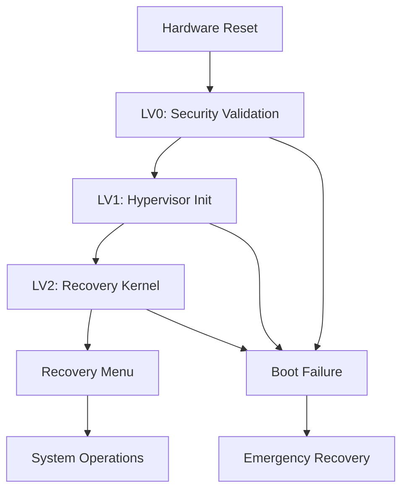

# GSCX Recovery Mode - Technical Documentation

## Overview

The GSCX Recovery Mode provides low-level hardware initialization and system recovery capabilities for PlayStation 3 emulation. This module implements maximum LLE (Low Level Emulation) with direct assembly integration for authentic hardware behavior.

## Architecture

### Multi-Stage Boot Sequence



### Core Components

#### 1. Recovery Entry Point
- **File**: `recovery_entry.c`
- **Purpose**: Assembly-level hardware initialization
- **Assembly Integration**: Direct CPU register manipulation

#### 2. Recovery Main Loop
- **File**: `recovery.cpp`
- **Purpose**: High-level recovery operations
- **Integration**: Called from assembly after hardware setup

#### 3. Bootloader Interface
- **Purpose**: Multi-stage boot sequence management
- **Stages**: LV0 → LV1 → LV2 progression

## Assembly Functions Reference

### Hardware Initialization Routines

#### CPU Setup
```assembly
; Initialize CPU registers and protection mode
recovery_cpu_init:
    cli                     ; Disable interrupts
    mov eax, cr0
    or eax, 1               ; Enable protected mode
    mov cr0, eax
    ret
```

#### Memory Management
```assembly
; Setup memory mapping for recovery mode
recovery_mmu_init:
    mov eax, page_directory ; Load page directory
    mov cr3, eax           ; Set page directory base
    mov eax, cr0
    or eax, 0x80000000     ; Enable paging
    mov cr0, eax
    ret
```

#### Interrupt Handling
```assembly
; Setup interrupt descriptor table
recovery_idt_init:
    lidt [idt_descriptor]   ; Load IDT
    sti                     ; Enable interrupts
    ret
```

### Boot Sequence Functions

#### LV0: Initial Validation
```cpp
/**
 * @brief LV0 boot stage - Security validation and hardware checks
 * 
 * Assembly Context:
 * - CPU in real mode, transitioning to protected mode
 * - No stack setup yet - uses registers only
 * - Hardware interrupts disabled
 * 
 * Responsibilities:
 * - Validate hardware signatures
 * - Check security certificates
 * - Initialize basic CPU features
 */
bool recovery_lv0_boot() {
    // Hardware validation logic
    // Security certificate checks
    // CPU feature detection
    return true;
}
```

#### LV1: Hypervisor Setup
```cpp
/**
 * @brief LV1 boot stage - Hypervisor initialization
 * 
 * Assembly Context:
 * - CPU in protected mode
 * - Basic stack available
 * - Memory management partially initialized
 * 
 * Responsibilities:
 * - Setup memory management unit (MMU)
 * - Initialize hypervisor layer
 * - Prepare system call interface
 */
bool recovery_lv1_boot() {
    // MMU initialization
    // Hypervisor setup
    // System call table preparation
    return true;
}
```

#### LV2: Recovery Kernel
```cpp
/**
 * @brief LV2 boot stage - Recovery kernel initialization
 * 
 * Assembly Context:
 * - Full protected mode with paging
 * - Complete stack and heap available
 * - Interrupt handling active
 * 
 * Responsibilities:
 * - Initialize recovery kernel services
 * - Setup device drivers
 * - Prepare recovery menu interface
 */
bool recovery_lv2_boot() {
    // Kernel service initialization
    // Device driver loading
    // Recovery menu preparation
    return true;
}
```

## Hardware Interface Specifications

### CPU Registers

| Register | Purpose | Recovery Usage |
|----------|---------|----------------|
| EAX | General Purpose | Boot stage status codes |
| EBX | General Purpose | Hardware validation flags |
| ECX | General Purpose | Loop counters, temporary data |
| EDX | General Purpose | I/O port addresses |
| ESP | Stack Pointer | Recovery stack management |
| EBP | Base Pointer | Stack frame management |
| ESI | Source Index | Memory copy operations |
| EDI | Destination Index | Memory copy operations |

### Memory Layout

```
0x00000000 - 0x000FFFFF : Real Mode Memory (1MB)
0x00100000 - 0x00FFFFFF : Recovery Kernel (15MB)
0x01000000 - 0x0FFFFFFF : Recovery Heap (240MB)
0x10000000 - 0x1FFFFFFF : Hardware Buffers (256MB)
0x20000000 - 0xFFFFFFFF : Reserved/Unused
```

### I/O Port Mapping

| Port Range | Device | Recovery Function |
|------------|--------|-------------------|
| 0x60-0x6F | Keyboard Controller | Menu navigation |
| 0x70-0x7F | CMOS/RTC | System time/date |
| 0x80-0x8F | DMA Controller | Memory transfers |
| 0x90-0x9F | System Control | Power management |

## Recovery Operations

### System Recovery Functions

#### Power Management
```cpp
// Power on sequence with hardware validation
void GSCX_PowerOn() {
    // Assembly: Initialize power management unit
    // Validate power supply stability
    // Enable system clocks
}

// Safe power off with state preservation
void GSCX_PowerOff() {
    // Save critical system state
    // Assembly: Shutdown sequence
    // Power management unit shutdown
}
```

#### Disc Operations
```cpp
// Eject disc with hardware safety checks
void GSCX_EjectDisc() {
    // Check disc drive status
    // Assembly: Drive motor control
    // Mechanical eject sequence
}

// Insert disc with validation
bool GSCX_InsertDisc(const char* iso_path) {
    // Validate ISO format
    // Mount virtual disc
    // Update drive status
}
```

### Recovery Menu System

#### Menu Structure
```
Recovery Menu
├── System Information
│   ├── Hardware Status
│   ├── Firmware Version
│   └── Memory Usage
├── System Recovery
│   ├── Restore Default Settings
│   ├── Rebuild Database
│   └── Format System Storage
├── Network Settings
│   ├── Internet Connection
│   ├── Network Configuration
│   └── System Update
└── Advanced Options
    ├── Debug Mode
    ├── Safe Mode
    └── Developer Settings
```

#### Menu Implementation
```cpp
// Display recovery menu with assembly graphics
void GSCX_ShowRecoveryMenu() {
    // Assembly: Initialize graphics mode
    // Render menu interface
    // Setup input handling
}

// Handle menu selection with validation
void GSCX_HandleMenuSelection(int selection) {
    // Validate selection range
    // Execute corresponding function
    // Update menu state
}
```

## Error Handling and Diagnostics

### Boot Failure Recovery

```cpp
/**
 * @brief Handle boot sequence failures
 * 
 * Assembly Integration:
 * - Called when LV0/LV1/LV2 stages fail
 * - Provides emergency recovery options
 * - Maintains minimal system functionality
 */
void recovery_boot_failure_handler(int stage, int error_code) {
    switch (stage) {
        case 0: // LV0 failure
            // Hardware validation failed
            // Enter emergency mode
            break;
        case 1: // LV1 failure
            // Hypervisor initialization failed
            // Attempt safe mode boot
            break;
        case 2: // LV2 failure
            // Recovery kernel failed
            // Minimal recovery menu
            break;
    }
}
```

### Hardware Diagnostics

```cpp
// Comprehensive hardware testing
bool recovery_hardware_test() {
    bool cpu_ok = test_cpu_functionality();
    bool memory_ok = test_memory_integrity();
    bool io_ok = test_io_ports();
    
    return cpu_ok && memory_ok && io_ok;
}

// Memory integrity checking
bool test_memory_integrity() {
    // Assembly: Memory pattern testing
    // Check for bad memory blocks
    // Validate memory controller
    return true;
}
```

## Performance Considerations

### Assembly Optimization

- **Register Usage**: Minimize memory access by keeping frequently used data in registers
- **Instruction Selection**: Use optimal instruction sequences for common operations
- **Cache Efficiency**: Align code and data to cache line boundaries
- **Branch Prediction**: Structure conditional code to favor predicted branches

### Memory Management

- **Stack Usage**: Minimize stack depth during critical boot sequences
- **Heap Allocation**: Use pre-allocated buffers for recovery operations
- **Memory Mapping**: Efficient page table management for virtual memory

## Security Model

### Boot Security

1. **Hardware Validation**: Verify authentic PlayStation 3 hardware signatures
2. **Certificate Checking**: Validate system certificates during LV0 stage
3. **Memory Protection**: Implement memory access controls in LV1 stage
4. **Privilege Separation**: Maintain hypervisor/kernel privilege boundaries

### Recovery Security

- **Access Control**: Restrict recovery operations based on security level
- **State Validation**: Verify system state before critical operations
- **Audit Logging**: Record all recovery operations for security analysis

## Integration with GSCX Core

### Module Interface

```cpp
// Module initialization
bool GSCX_Initialize(void* host_ctx);

// Recovery mode entry points
void GSCX_RecoveryMain();
bool GSCX_BootRecoveryMode();

// System operations
void GSCX_PowerOn();
void GSCX_PowerOff();

// Cleanup
void GSCX_Shutdown();
```

### Host Services Integration

- **Logging**: Integration with GSCX logging system
- **Configuration**: Access to system configuration
- **Resource Management**: Coordination with host resource allocation

## Troubleshooting

### Common Issues

1. **Boot Failure**: Check hardware validation logs
2. **Memory Errors**: Run memory diagnostic tests
3. **I/O Problems**: Verify port accessibility
4. **Menu Unresponsive**: Check input handling initialization

### Debug Information

- **Boot Logs**: Detailed logging of each boot stage
- **Register Dumps**: CPU register state at failure points
- **Memory Maps**: Current memory allocation status
- **Hardware Status**: Real-time hardware monitoring

## Future Enhancements

### Planned Features

- **Network Recovery**: Remote recovery capabilities
- **Advanced Diagnostics**: Comprehensive hardware testing
- **Custom Recovery**: User-defined recovery procedures
- **Performance Monitoring**: Real-time system performance analysis

### SYSCON Integration

- **Virtual SYSCON**: Transition from firmware interception to full virtualization
- **Hardware Emulation**: Complete hardware interface emulation
- **Real-time Response**: Maintain authentic timing characteristics

---

*This documentation is part of the GSCX PlayStation 3 Emulator project. For additional information, see the main project documentation in `docs.md`.*